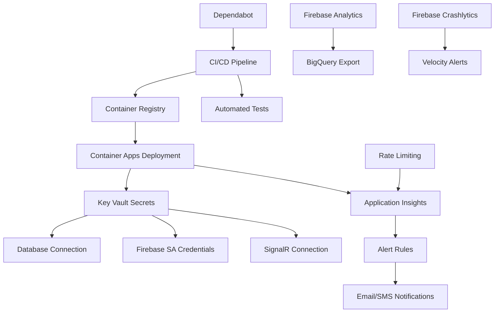

# Services Implementation Plan — Production Readiness

- Read: false
- Approved: false
- Notes: NA

> **Document type:** Implementation plan for monitoring, security, analytics, DevOps, and production-readiness services.
> **Author:** Lorenzo + Claude
> **Last updated:** June 2026
> **Budget constraint:** €50/month Azure credit (company-provided)

---

## 1. Overview

This document covers the full set of services, integrations, and hardening work required to bring Hausly from a local dev setup to a production-ready deployment. Each section includes reasoning, cost estimates, and step-by-step implementation guidance.

Current stack baseline:
- **Backend:** FastAPI on Azure Container Apps (Consumption plan, scale-to-zero)
- **Database:** Azure PostgreSQL Flexible Server (Burstable B1ms)
- **Auth:** Firebase Auth (free tier)
- **Real-time:** Azure SignalR Service (free tier)
- **Mobile:** React Native + Expo (managed workflow)
- **Infra-as-code:** Bicep (Azure)

---

## 2. Priority Order

Implementation should proceed in this sequence. Items are grouped by urgency and dependency.

### Tier 1 — Foundational (implement before any staging/prod deployment)
1. CI/CD Pipeline (GitHub Actions) — catches breakage before it reaches any environment
2. Secret Management (Azure Key Vault) — remove secrets from repo and images
3. Application Insights (Azure Monitor) — server-side observability
4. API Rate Limiting — prevent abuse and budget exhaustion
5. Input Validation Hardening — defense-in-depth for all API endpoints
6. GitHub Dependabot — automated vulnerability scanning

### Tier 2 — Visibility (implement before public beta)
7. Health Check Monitoring (Azure Availability Tests or UptimeRobot)
8. Firebase Crashlytics — mobile crash visibility
9. Alerting Rules (Azure Monitor) — automated incident detection
10. Firebase Analytics — user behavior and module adoption tracking

### Tier 3 — App Store & Compliance (implement before store submission)
11. Push Notifications (Firebase Cloud Messaging)
12. GDPR Compliance (privacy policy, data export, account deletion)
13. Custom Domain + SSL
14. API Versioning Strategy lock-down

### Tier 4 — Operational Maturity (implement as usage grows)
15. Database Backup verification & secondary backup to Blob Storage
16. Migration safety (init container or CI pre-deploy step)
17. Mobile OTA Updates (EAS Update)

---

## 3. Monitoring & Observability

### 3.1 Azure Application Insights

**Why Application Insights over alternatives (Datadog, New Relic, self-hosted Grafana):**
- Native integration with Azure Container Apps — zero network hops for telemetry.
- Free tier: 5 GB/month ingestion — sufficient for a solo-dev project with <1000 DAU.
- OpenTelemetry-based: vendor-neutral instrumentation, you can swap providers later.
- Unified platform: logs, traces, metrics, and exceptions in one place. No need to stitch together Prometheus + Grafana + Loki + Jaeger.
- Alternatives cost more (Datadog: $15/host/month minimum) or require operational overhead (self-hosted Grafana needs a server).

**What it provides:**
- End-to-end distributed tracing (API request → DB query → SignalR push → response)
- Automatic dependency tracking (PostgreSQL, HTTP calls to Firebase, Azure OpenAI)
- Exception tracking with full stack traces and request context
- Live metrics stream for real-time debugging
- Application Map (visual dependency graph)
- Performance profiling (slow requests, P95/P99 latencies)
- Custom metrics (e.g., "expense splits calculated per hour", "grocery sessions completed")

**Cost estimate:** €0/month at dev scale. At production scale with moderate traffic (5K DAU), expect 1-2 GB/month ingestion — still within free tier.

**Implementation steps:**

1. **Create Application Insights resource:**
   - Add Bicep module at `infra/modules/app-insights.bicep`
   - Connect to existing Log Analytics workspace (or create one — free tier: 5 GB/month)
   - Output the connection string for Container Apps configuration

2. **Instrument the FastAPI backend:**
   - Install: `azure-monitor-opentelemetry` + `opentelemetry-instrumentation-fastapi`
   - Initialize in `hausly/main.py` before app creation
   - Configuration via `APPLICATIONINSIGHTS_CONNECTION_STRING` env var
   - Custom spans for business-critical operations (expense splitting, grocery session completion)

3. **Structured logging integration:**
   - Replace print/basic logging with Python's `logging` module + OpenTelemetry log exporter
   - Add `correlation_id` (from request headers or generated) to every log entry
   - Log levels: ERROR for exceptions, WARNING for rate limits / auth failures, INFO for business events

4. **Custom metrics:**
   - Track: requests per module, expense creation rate, grocery session duration, SignalR message volume
   - Use OpenTelemetry Meter API for custom counters and histograms

5. **Dashboard setup:**
   - Create a shared Azure Dashboard with: request rate, error rate, P95 latency, top exceptions, dependency health

### 3.2 Firebase Crashlytics (Mobile)

**Why Crashlytics over Sentry/Bugsnag:**
- Already in the Firebase ecosystem — no new SDK, no new vendor relationship.
- Completely free, no event limits.
- Sentry's free tier (5K events/month) could be exceeded by a single bad release.
- Native React Native support via `@react-native-firebase/crashlytics`.
- Crash-free user percentage, ANR detection, and breadcrumb trails included.

**What it provides:**
- Crash reports with stack traces, device info, OS version
- Non-fatal error tracking (network failures, unexpected states)
- Breadcrumbs: last N user actions before the crash
- Crash-free users percentage (key app store quality metric)
- Velocity alerts: sudden spike in crash rate
- Integration with Firebase Analytics: see crashes in context of user journeys

**Implementation steps:**

1. **Enable Crashlytics in Firebase Console:**
   - Navigate to project → Crashlytics → Enable for Android/iOS

2. **Install dependencies (requires EAS Build / dev client — not Expo Go):**
   ```bash
   npx expo install @react-native-firebase/app @react-native-firebase/crashlytics
   ```

3. **Configure native modules:**
   - Android: add `google-services.json` to `apps/mobile/android/app/`
   - iOS: add `GoogleService-Info.plist` when iOS build is configured
   - Add Crashlytics Gradle plugin to `android/build.gradle`

4. **Initialize in app code:**
   - Wrap app root with error boundary that logs to Crashlytics
   - Set user identifiers: `crashlytics().setUserId(uid)` after auth
   - Set custom keys: `household_id`, `household_type` for crash grouping
   - Log non-fatal errors: API failures, SignalR disconnections, sync conflicts

5. **Test crash reporting:**
   - Use `crashlytics().crash()` in a debug build to verify end-to-end flow
   - Verify symbolication works for release builds

### 3.3 Health Check Monitoring

**Options:**
- **Azure Monitor Availability Tests** (free: 5 web tests) — stays within Azure ecosystem
- **UptimeRobot** (free: 50 monitors, 5-min intervals) — independent of Azure (survives Azure outages)

**Recommendation:** Use both. Azure Availability Tests for detailed diagnostics; UptimeRobot as an external failsafe that alerts you even if Azure Monitor itself is down.

**Implementation:**
- Monitor: `GET /api/health` every 5 minutes
- Health endpoint should check: DB connectivity, SignalR connection string validity
- Alert via email + push notification on 2 consecutive failures

### 3.4 Alerting Rules

Configure in Azure Monitor after Application Insights is live:

| Alert | Condition | Severity | Action |
|-------|-----------|----------|--------|
| High error rate | Error rate > 5% over 5 min | Sev 2 | Email |
| Slow responses | P95 latency > 3s over 5 min | Sev 3 | Email |
| Container restarts | Restart count > 2 in 10 min | Sev 2 | Email |
| DB connection failures | Failed connections > 5 in 5 min | Sev 1 | Email + SMS |
| Budget alert | Monthly spend > €40 | Sev 3 | Email |

**Cost:** Alert rules are free to configure. SMS notifications cost €0.02/message.

---

## 4. Security

> Full details in [docs/security.md](../security.md)

### 4.1 Azure Key Vault

**Why Key Vault over alternatives (HashiCorp Vault, AWS Secrets Manager, env vars in CI):**
- Native Container Apps integration: secrets are pulled at deployment time and injected as env vars. No application code changes needed.
- Free tier: 10,000 transactions/month — ample for a single-service deployment.
- Audit trail: every secret access is logged. Useful for security audits.
- Secret rotation: can rotate secrets without redeploying the application.
- HashiCorp Vault requires self-hosting (operational overhead). AWS Secrets Manager costs $0.40/secret/month.

**Secrets to migrate:**
- `DATABASE_URL` (PostgreSQL connection string with credentials)
- `FIREBASE_SERVICE_ACCOUNT_JSON` (currently a file — store as secret, load from env var)
- `SIGNALR_CONNECTION_STRING`
- `AZURE_OPENAI_KEY`
- Any future API keys (FCM server key, etc.)

**Implementation steps:**

1. **Create Key Vault resource:**
   - Add `infra/modules/key-vault.bicep`
   - Enable RBAC authorization model (not access policies — more granular, Azure AD-native)
   - Grant Container Apps managed identity "Key Vault Secrets User" role

2. **Migrate secrets:**
   - Store all secrets in Key Vault via Azure CLI or Bicep
   - Update Container Apps deployment to reference Key Vault secrets
   - Remove all secrets from `.env` files, `docker-compose.yml`, and repo history

3. **Remove `firebase-sa.json` from repo:**
   - Store the JSON content as a single Key Vault secret
   - Parse it at runtime from the env var in `config.py`
   - Add `firebase-sa.json` to `.gitignore`
   - Consider: `git filter-branch` or BFG to remove from history

4. **Local development:**
   - Use `azure-identity` DefaultAzureCredential for local Key Vault access
   - Or keep a local `.env` (gitignored) for dev-only, with Key Vault for all deployed environments

### 4.2 GitHub Dependabot

**Configuration:**

```yaml
# .github/dependabot.yml
version: 2
updates:
  - package-ecosystem: "pip"
    directory: "/apps/api"
    schedule:
      interval: "weekly"
    open-pull-requests-limit: 5
    labels: ["dependencies", "security"]

  - package-ecosystem: "npm"
    directory: "/apps/mobile"
    schedule:
      interval: "weekly"
    open-pull-requests-limit: 5
    labels: ["dependencies", "security"]

  - package-ecosystem: "github-actions"
    directory: "/"
    schedule:
      interval: "monthly"
```

**Why weekly and not daily:** Solo developer. Daily PRs create noise. Weekly batches are reviewable in one sitting.

### 4.3 API Rate Limiting

**Why rate limiting is critical:**
- Azure Container Apps bills by vCPU-seconds. A bot hammering your API costs real money.
- Azure OpenAI has hard rate limits — if your API doesn't limit first, users get cryptic 429s from Azure.
- Firebase Auth verification has per-project quotas.
- A single malicious user could exhaust SignalR's free tier (20K messages/day) in minutes.

**Rate limiting configuration (reasoning):**

| Endpoint Category | Limit | Reasoning |
|---|---|---|
| Auth endpoints (`/api/auth/*`) | 10 req/min/IP | Login/register are high-value targets for credential stuffing |
| Write endpoints (POST/PUT/DELETE) | 30 req/min/user | Normal usage is ~5-10 writes/min max during active grocery shopping |
| Read endpoints (GET) | 120 req/min/user | Real-time polling, list fetches — higher but still bounded |
| AI endpoints (future) | 5 req/min/user | Azure OpenAI token cost protection |
| Health check | No limit | Monitoring must always work |

**Implementation approach:**
- Use `slowapi` (built on `limits` library) — thin wrapper over FastAPI's dependency injection
- Store rate limit state in-memory for single-instance dev, Redis for multi-instance prod
- Return `429 Too Many Requests` with `Retry-After` header
- Log rate limit hits to Application Insights as warnings (early abuse detection)

### 4.4 Input Validation Hardening

**Audit checklist:**
- [ ] All path parameters have type constraints (UUID validation, not raw strings)
- [ ] All query parameters have max length limits
- [ ] Request body sizes are bounded (FastAPI default is unlimited — add middleware)
- [ ] File uploads (future: receipt images) have size limits and MIME type validation
- [ ] SQL injection is impossible (SQLModel parameterizes all queries — verify no raw SQL)
- [ ] No user input is rendered in error messages (prevents information leakage)
- [ ] Pydantic `Field()` constraints: `max_length`, `ge`, `le` on all numeric fields
- [ ] List fields have `max_items` constraints (prevent memory exhaustion via huge payloads)

**Implementation:**
- Add `MAX_REQUEST_BODY_SIZE` middleware (e.g., 1 MB default, 10 MB for image uploads)
- Audit all Pydantic models for missing constraints
- Add integration test that sends oversized/malformed payloads and verifies 422 responses

---

## 5. Analytics — Firebase Analytics

**Why deep Firebase Analytics integration matters:**
- Strategic risk #1 from the project plan: "Multi-module adoption is the entire moat." You need data to know if households actually use ≥2 modules.
- Without analytics, you're guessing at what to build next.
- Firebase Analytics is free, unlimited events, and integrates with the existing Firebase Auth user identity.

**Events to track:**

### 5.1 Core Business Events

| Event Name | Parameters | Why |
|---|---|---|
| `household_created` | `household_type`, `member_count` | Onboarding funnel |
| `household_joined` | `invite_method`, `household_type` | Virality measurement |
| `module_first_use` | `module_name` (grocery/expense/meal/chore) | Cross-module adoption |
| `grocery_session_started` | `item_count` | Shopping engagement |
| `grocery_session_completed` | `item_count`, `duration_seconds`, `expense_created` | Integration chain completion |
| `expense_created` | `source` (manual/grocery/recurring), `split_type`, `amount_range` | Revenue proxy, integration validation |
| `expense_settled` | `settlement_count`, `total_amount_range` | Feature value delivered |
| `meal_slot_claimed` | `slot_type` (lunch/dinner), `day_offset` | Meal planner engagement |
| `chore_completed` | `was_assigned_to_completer`, `days_overdue` | Chore accountability |

### 5.2 Engagement & Retention Events

| Event Name | Parameters | Why |
|---|---|---|
| `app_session_start` | `modules_active_in_household` | Multi-module correlation |
| `notification_opened` | `notification_type` | Push notification ROI |
| `signalr_reconnected` | `disconnect_duration_seconds` | Real-time reliability |
| `offline_sync_completed` | `conflict_count`, `resolution_type` | Offline UX quality |

### 5.3 User Properties (set once, update on change)

| Property | Value | Why |
|---|---|---|
| `household_type` | couple/friends/students/family | Segment by audience |
| `household_size` | integer | Correlate engagement with group size |
| `modules_enabled` | comma-separated list | Track multi-module adoption per user |
| `is_admin` | boolean | Admin vs member behavior differences |
| `account_age_days` | integer (updated weekly) | Retention cohort analysis |

### 5.4 Implementation Steps

1. **Install Firebase Analytics SDK:**
   ```bash
   npx expo install @react-native-firebase/app @react-native-firebase/analytics
   ```

2. **Create analytics service (`apps/mobile/services/analytics.ts`):**
   - Typed event logging functions (one per event, enforcing parameter types)
   - User property setters (called on auth state change and household join/leave)
   - Opt-out support (GDPR: user must be able to disable analytics)

3. **Integrate into hooks/screens:**
   - Fire events from existing hooks (`useGrocery`, `useExpenses`, `useMeals`, `useChores`)
   - Track screen views via React Navigation integration
   - Track app session duration

4. **Firebase Console setup:**
   - Create custom audiences: "Multi-module users" (used ≥2 modules in 7 days)
   - Create funnels: Onboarding → First grocery list → First expense → First meal plan
   - Set up weekly export to BigQuery (free tier: 1 TB query/month) for advanced analysis

5. **Privacy compliance:**
   - Show analytics consent in onboarding (required for GDPR)
   - Respect user opt-out: `analytics().setAnalyticsCollectionEnabled(false)`
   - Do not log PII (no names, emails, amounts — use ranges for amounts)

---

## 6. DevOps — CI/CD Pipeline

> Full details in [docs/ci-cd-plan.md](../ci-cd-plan.md)

**Summary:**
- Platform: GitHub Actions (free for private repos up to 2000 min/month)
- Container registry: Azure Container Registry (Basic tier, ~€4/month)
- Deployment target: Azure Container Apps
- Mobile builds: EAS Build (free tier: 30 builds/month)

**Pipeline overview:**
```
PR opened/updated → Lint + Type Check → Unit Tests → Build (no deploy)
Push to main      → Lint + Type Check → Unit Tests → Build Image → Deploy to staging
Manual trigger    → Deploy staging → production (after approval)
```

---

## 7. Cost Summary

| Service | Monthly Cost | Notes |
|---|---|---|
| Azure Container Apps (Consumption) | ~€5-10 | Scale-to-zero, pay per request |
| Azure PostgreSQL (B1ms) | ~€12-15 | Smallest Flexible Server tier |
| Azure Container Registry (Basic) | ~€4 | Docker image storage |
| Azure Application Insights | €0 | 5 GB/month free ingestion |
| Azure Key Vault | €0 | 10K operations/month free |
| Azure SignalR (Free) | €0 | 20 concurrent connections |
| Azure Blob Storage | ~€0.10 | Minimal dev usage |
| Azure Monitor Alerts | €0 | Alert rules are free |
| Firebase Auth | €0 | Free tier |
| Firebase Analytics | €0 | Unlimited events |
| Firebase Crashlytics | €0 | Unlimited crash reports |
| Firebase Cloud Messaging | €0 | Unlimited push notifications |
| GitHub Actions | €0 | 2000 min/month for private repos |
| EAS Build + Update | €0 | Free tier covers solo dev |
| Domain registration | ~€1/month (€12/year) | One-time, amortized |
| **Total estimate** | **~€22-30/month** | Well within €50 budget |

**Remaining budget headroom:** €20-28/month for Azure OpenAI tokens when AI features activate.

---

## 8. Deferred Items (Process Later)

These are documented for future implementation but are not in the immediate plan:

### 8a. Database Backups & Disaster Recovery
- Azure PostgreSQL Flexible Server includes automated backups (7-day retention). **Verify enabled.**
- Secondary: nightly `pg_dump` to Blob Storage via Container Apps scheduled job (~€0.01/month).
- Test restore-from-backup at least once before production launch.

### 8b. Push Notifications (Firebase Cloud Messaging)
- Essential for: chore reminders, expense settlement nudges, grocery list updates when backgrounded.
- Free, unlimited. Already in Firebase ecosystem.
- Requires EAS Build (not Expo Go) — same as Crashlytics.
- Server-side: send via Firebase Admin SDK (already partially configured for auth).

### 8c. GDPR Compliance
- Privacy policy URL (required for both app stores).
- `GET /api/v1/me/data` — data export endpoint.
- `DELETE /api/v1/me` — account deletion (Apple requires this).
- Analytics opt-out toggle in app settings.
- Data retention policy documented.

### 8d. Custom Domain + SSL
- Register `hausly.app` or similar (~€12/year).
- Configure custom domain on Container Apps (free managed certificate).
- Update mobile app API base URL.
- Set up DNS with Azure DNS or Cloudflare (free tier).

### 8e. API Versioning Lock-down
- Current: `/api/...` (unversioned). Must become `/api/v1/...` before store submission.
- Breaking changes after v1 go to `/api/v2/...` with deprecation timeline.
- Mobile app embeds the API version it was built against.

### 8f. Database Migration Safety
- Run Alembic migrations as a Container Apps init container (runs before the app starts).
- Or: dedicated migration step in CI/CD pipeline before deployment.
- Never SSH into production to run migrations manually.

### 8g. Mobile OTA Updates (EAS Update)
- Free tier: 1000 monthly active users.
- Push JS bundle updates without app store review.
- Critical for hotfixes post-launch.
- Configure update channels: `production`, `staging`, `preview`.

---

## 9. Integration Dependencies



**Key dependencies:**
- Key Vault must exist before Container Apps can reference secrets → implement Key Vault first.
- Application Insights must exist before alerting can be configured → implement observability before alerts.
- CI/CD pipeline must exist before automated deployments → implement CI/CD first (hence priority #1).
- Firebase Crashlytics and Analytics both require EAS Build → bundle their setup together.
